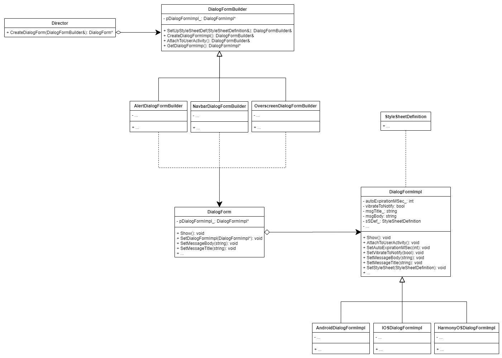

Метапрограммирование д/з 1  
---
3C: Builder & Bridge  
---
##### Мотивация совместного использования

Как хорошо интегрировать паттерны "Мост" и "Строитель"?  
  
Паттерн "Строитель" может быть построен в виде "Моста": директор будет играть роль абстракции, а строители — реализации. 
Еще одним подходом может служить модификация применения "Моста" через "Строитель" — разложение одной иерархии на несколько отдельных иерархий,
где одна из иерархий заменена порождением через "Строитель". Последний вариант и будет продемонстрирован ниже.

##### Пример промышленной задачи, в которой можно использовать такую архитектурную конструкцию  

Команда мобильной разработки в банке разрабатывает мобильный банкинг под несколько платформ в попытках завлечь побольше
потенциальных пользователей своей клиентоориентированностью. Кододелы пишут под 3 платформы: IOS, Android, HarmonyOS (Huawei).
Для большого удобства было решено реализовать кросс-платформенную библиотеку с готовыми виджетами (некий ui-kit). Рассмотрим
пример, как были бы реализованы диалоговые формы в этой библиотеке.  
В библиотеке используется три типа таких форм (`Alert`, `Navbar`, `Overscreen`), которые внешне и поведенчески не сильно отличаются, если забыть про реализацию 
на нативном API. За счет мультиплатформенной разработки, наивная статическая иерархия таких форм имела бы девять отдельных классов (3 вида под 3 разные платформы).  
Путем применения "Моста" мы можем получить две иерархии по 3 класса: по типам и по платформам, что лучше.  
Для первой иерархии понятно, что ее классы требуют кропотливой пошаговой инициализации множества полей и вложенных объектов. 
Их код инициализации обычно спрятан внутри монструозного конструктора с десятком параметров. И тут на подмогу нам приход
"Строитель", заменяя собой слабомотивированную иерархию.

В действительности, в данном примере дважды применяется паттерн "Мост":
1. для разложения сложной иерархии на две более простые;
2. для разделения бизнесс-логики от подкапотной реализации (`DialogForm` и `DialogFormImpl`).

Сам "Cтроитель" реализует собой одну из иерархий, как и было упомянуто ранее.
  
А вот и сама диаграмма:
